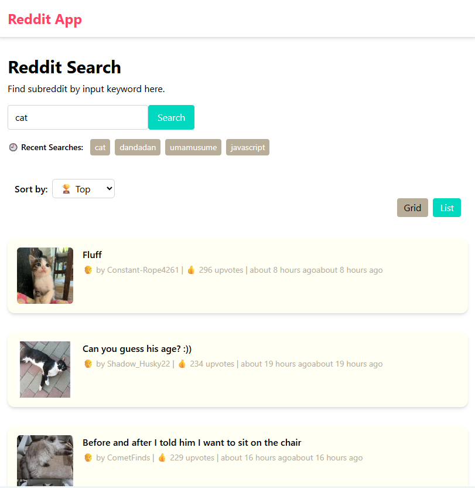
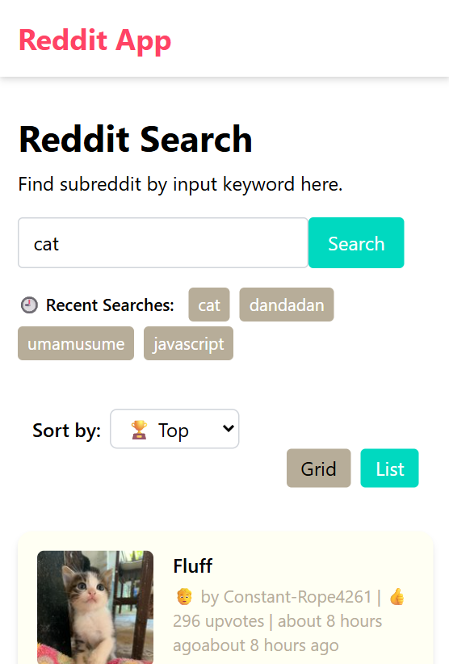

# Reddit Viewer App

A web application for browsing posts from various Reddit subreddits.

---

## 📐 Screenshots

### 🖥️ Desktop

  

### 📱 Mobile

  

## 🛠 Technologies Used

- React
- Redux (for state management)
- JavaScript (ES6+)
- Tailwind CSS (for styling)
- Reddit API (data source)
- Git & GitHub (version control)
- GitHub Projects (task planning)
- Jest & React Testing Library (unit testing)
- Cypress (end-to-end testing)
- Render (deployment)
---

## Features

- 🔍 Search and display posts from any subreddit
- ⌨️ Enter subreddit name via input field with Enter key support
- ⏳ Show a loading indicator while fetching posts
- ⚠️ Display an error message for invalid or empty subreddits
- 🌐 Clickable links to open Reddit posts in a new tab
- 📱 Fully responsive design for desktop and mobile devices
- 🚀 Achieves 90+ Lighthouse performance score
- 🖼️ Post detail view with modal style
- 🎚️ Filter posts by categories (e.g., hot, new, top)
---

## 🧪 Testing

This project uses Jest and React Testing Library for unit testing.

- [ ] Tests are located alongside source files (e.g., postsSlice.test.js).
- To run tests: npm test
- To check test coverage: npm test -- --coverage

🔍What’s Covered

- [ ] Redux slice logic (postsSlice.js)
  - Async thunk fetchPosts tested for success and failure cases
  - Reducers setSubreddit, setSort tested
- [ ] Component rendering and interaction (PostItem.js, PostModal.js)

🚫 Enzyme Note
Enzyme was considered but not used due to incompatibility with React 19.
All tests were written using modern tools like React Testing Library instead.

---

## 🚧 Future Work

- Improve animations and UI transitions
- Add Progressive Web App (PWA)

---

## 🌍 Deployment

This app is deployed via **Render** at the following public URL:
🔗 [Live App](https://reddit-app-9jal.onrender.com/))

---

## 📱 Responsive Design

The application is designed to work on:

- Desktop
- Mobile devices

---

## 📦 Project Management

Task tracking and planning are managed via  
[GitHub Projects]　(https://github.com/users/Namane00426/projects/3)

---

## 📝 License

This project is licensed under the MIT License.
